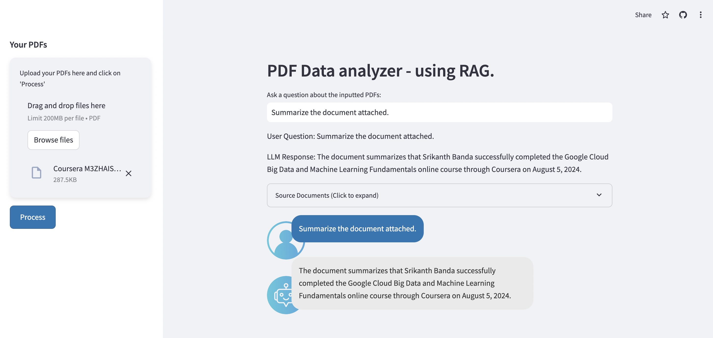

# PDF Data Analyzer - Conversational PDF Querying with Google Gemini AI

## Project Overview

The **PDF Data Analyzer** is an AI-powered chatbot application that allows users to upload PDF documents and ask questions using natural language. The system responds with relevant, context-aware answers by leveraging Google's **Gemini AI** model for both conversational responses and document embeddings. The application is built using **Streamlit** for the user interface and **FAISS** for vectorized document search.

This project is ideal for anyone needing to search and retrieve information from large PDF documents in an interactive, conversational way. Whether for research, legal documents, or academic papers, the PDF Data Analyzer is designed to make document querying seamless and intuitive.

## Features

- **Google Gemini AI Integration**: Uses Google's **Generative AI embeddings** and **Gemini Pro** for natural language understanding and document interaction.
- **Conversational Interface**: A chatbot-like experience where users can ask questions about PDF documents and receive accurate answers.
- **PDF Text Extraction**: Automatically extracts text from uploaded PDFs for processing and analysis.
- **Embeddings and Vector Search**: Uses **FAISS** to convert text chunks into embeddings and retrieve relevant content based on semantic similarity.
- **Real-time Response**: Processes PDFs and returns answers almost instantly, improving user productivity.
- **Streamlit Interface**: Simple and elegant web-based interface, allowing for easy user interaction.
- **AWS S3 Support**: Optional integration with AWS S3 for cloud storage of PDFs.

## Experience the live project

Check out the live [Streamlit app demo](https://gemini-genai-doc-chatbot.streamlit.app/).

Project UI:


## System Design:


## Installation

### 1. Clone the Repository

```bash
git clone git@github.com:Srikanth-Banda/PDF-Data-Analyzer.git
cd PDF-Data-Analyzer
```

### 2. Set Up a Virtual Environment

```bash
python3 -m venv pdf-chat-env
source pdf-chat-env/bin/activate
```

### 3. Install Dependencies

```bash
pip install -r requirements.txt
```

### 4. Set Up Environment Variables

Create a `.env` file in the root of the project and add your **Google API Key**:

```bash
GOOGLE_API_KEY=your_google_api_key
```

(Optional) If using AWS S3, also add:

```bash
AWS_ACCESS_KEY_ID=your_aws_access_key
AWS_SECRET_ACCESS_KEY=your_aws_secret_key
AWS_BUCKET=your_s3_bucket_name
```

### 5. Run the Application

```bash
streamlit run app.py
```

You can now access the application on `http://localhost:8501` and start interacting with your PDF documents.

## Usage

- **Upload PDFs**: Upload one or multiple PDF files using the sidebar.
- **Ask Questions**: Once processed, ask natural language questions about the contents of the PDFs.
- **Get Answers**: The system will return the most relevant sections of the PDF in response to your queries.

## Tech Stack

- **LangChain**: For processing text and conversational AI logic.
- **Google Gemini AI**: Provides embeddings and conversational responses.
- **FAISS**: Efficient vector search for document retrieval.
- **PyPDF2**: Extracts text from uploaded PDF documents.
- **Streamlit**: Frontend for the web interface.
- **AWS S3**: (Optional) For cloud-based PDF storage.


## Future Improvements

- **Support for Additional File Types**: Extend support to Word, Excel, and other document types.
- **Multi-lingual Support**: Add support for querying PDFs in multiple languages.
- **User Authentication**: Implement authentication for secure file uploads and personalized queries.

## Contributing

Contributions are welcome! Please submit a pull request or open an issue to suggest improvements.

## License

This project is licensed under the MIT License. See the [LICENSE](LICENSE) file for more details.
